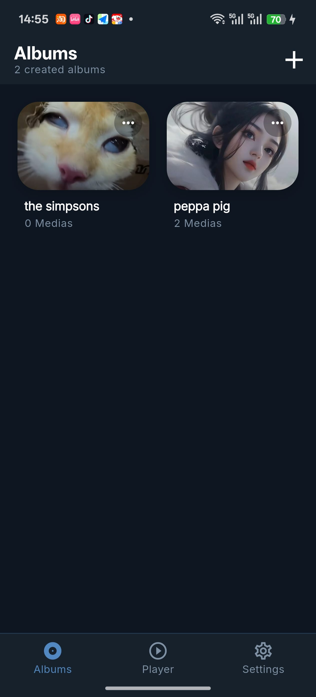
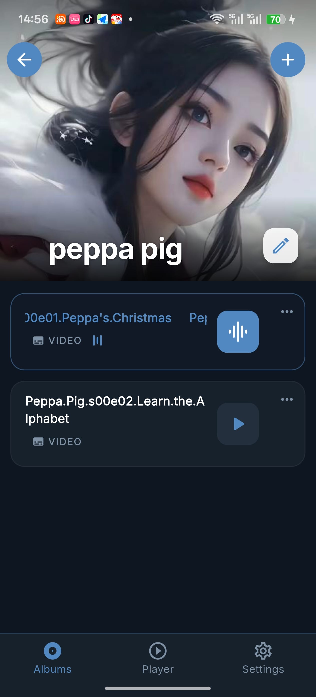
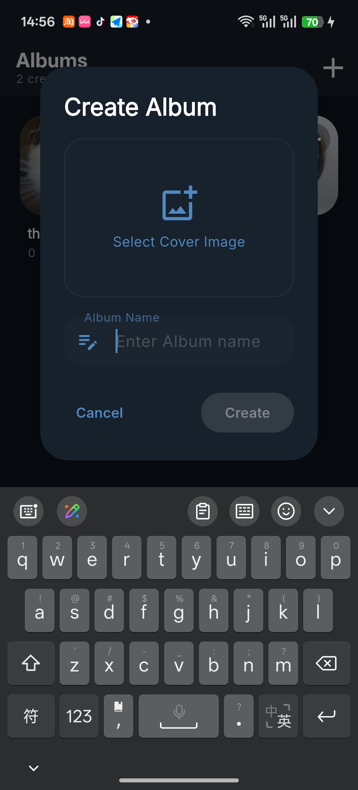
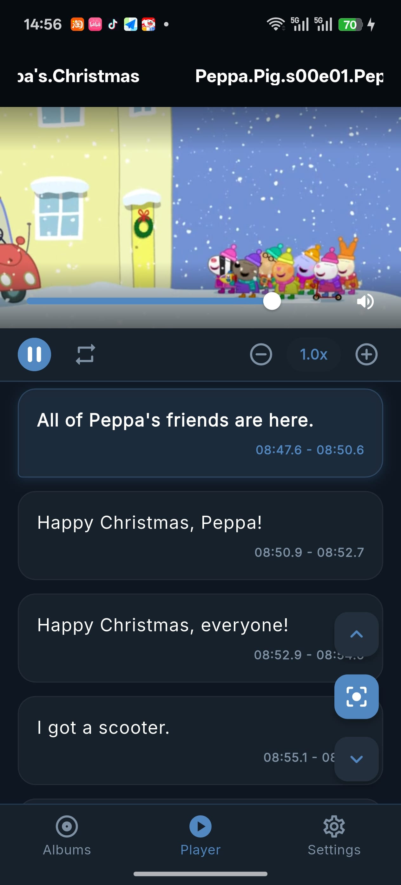
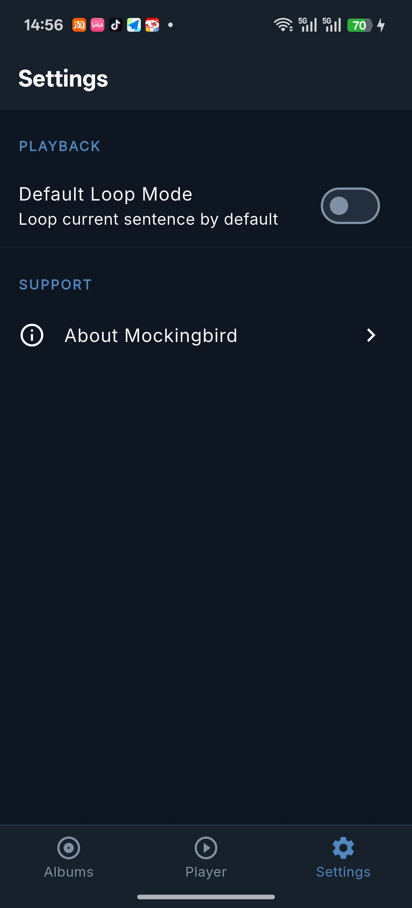

# 🐦 Mockingbird

**Mockingbird** is a high-performance language shadowing application built with Flutter. It is designed to help language learners achieve fluency through deliberate practice by shadowing audio and video clips with pixel-perfect subtitle synchronization.

---

## 📸 Screenshots

| Albums Grid | Album Detail | Create Album | Immersive Player | Settings |
| :---: | :---: | ----- | ----- | ----- |
|  |  |  |  |  |

---

## 🌟 Key Features

-   **🎬 Dual Media Support**: Seamlessly shadow both audio and video files.
-   **⏱️ Precision Shadowing**: Automated sentence-by-sentence breakdown and looping for focused practice.
-   **📂 Smart Library**: Organize your learning materials into beautiful, customizable albums.
-   **🧠 Intelligent Importer**: Automatically matches media files with their corresponding subtitle files (`.srt`, `.vtt`).
-   **🎨 Premium Dark Aesthetic**: A Telegram-inspired "Night Mode" interface optimized for focus and long study sessions.
-   **⚡ High Performance**: Powered by ObjectBox for instant database operations and Riverpod for reactive state management.

---

## 🌟 Usage

-   **[FFmpeg](https://github.com/ffmpeg/ffmpeg)**: If your videos are not fluent while playing in the app, transform your video into modern h264 mp4 format for better support at Android device.
-   **[Whisper](https://github.com/openai/whisper)**: Use whisper to generate subtitle if you can't find subtitles for your media.
-   **[LocalSend](https://localsend.org)**: Use LocalSend to send files between your PC and Phone.
-   **Mockingbird**: Create your album, import your video/audio and subtitle into it, if your subtitle's file name matches your video/audio's name, it will auto related, **peppa.pig.s01e01.eng.srt** will match **peppa.pig.s01e01.mp4** because the subtitle name contains the media name.

------

## 📩 Contact

Developed with ❤️ by **pangyulei**.

-   **Email**: [pangyulei@gmail.com](mailto:pangyulei@gmail.com)
-   **QQ频道**: m0ckingbird 大家可以分享整理好的音视频和字幕，因为网上的字幕多少有些匹配不上的小瑕疵

---

## 📄 License

This project is proprietary and for personal use only.
